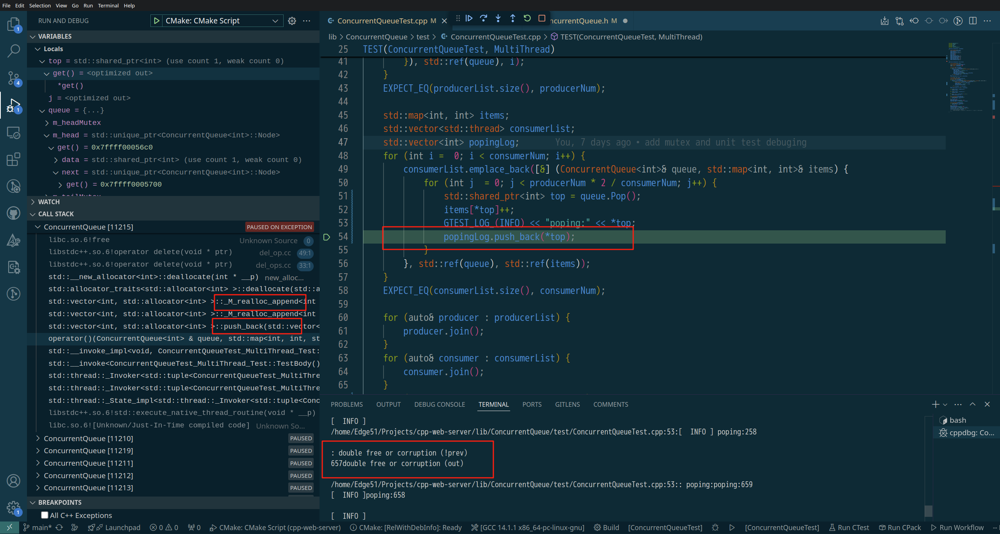

# Bug Records
### [BUG20240815001] unit test exception double free or corruption
the unit test occationally crash with exception occur.

log:
```
[  INFO ] 
/home/Edge51/Projects/cpp-web-server/lib/ConcurrentQueue/test/ConcurrentQueueTest.cpp:53:[  INFO ] poping:258

: double free or corruption (!prev)
657double free or corruption (out)

/home/Edge51/Projects/cpp-web-server/lib/ConcurrentQueue/test/ConcurrentQueueTest.cpp:53:: poping:poping:659
[  INFO ]poping:658

```

the exception call stack shows that the exception happens at the line popingLog.push_back(*top;)
``` cpp
    std::vector<int> popingLog;
    for (int i =  0; i < consumerNum; i++) {
        consumerList.emplace_back([&] (ConcurrentQueue<int>& queue, std::map<int, int>& items) {
            for (int j  = 0; j < producerNum * 2 / consumerNum; j++) {
                std::shared_ptr<int> top = queue.Pop();
                items[*top]++;
                GTEST_LOG_(INFO) << "poping:" << *top;
                popingLog.push_back(*top); // exception occur
            }
        }, std::ref(queue), std::ref(items));
    }
    EXPECT_EQ(consumerList.size(), consumerNum);
```
and the exception stack shows the vector is calling realloc_append, so I think it's out of space. and two thread simultaneously realloc memory which incur the exception double free or corruption.
``` shell
    libc.so.6![Unknown/Just-In-Time compiled code] (Unknown Source:0)
libc.so.6!raise (Unknown Source:0)
libc.so.6!abort (Unknown Source:0)
libc.so.6![Unknown/Just-In-Time compiled code] (Unknown Source:0)
libc.so.6!free (Unknown Source:0)
libstdc++.so.6!operator delete(void * ptr) (/usr/src/debug/gcc/gcc/libstdc++-v3/libsupc++/del_op.cc:49)
libstdc++.so.6!operator delete(void * ptr) (/usr/src/debug/gcc/gcc/libstdc++-v3/libsupc++/del_ops.cc:33)
std::__new_allocator<int>::deallocate(int * __p) (/usr/include/c++/14.2.1/bits/new_allocator.h:156)
std::allocator_traits<std::allocator<int> >::deallocate(std::allocator_traits<std::allocator<int> >::pointer __p) (/usr/include/c++/14.2.1/bits/alloc_traits.h:513)
std::vector<int, std::allocator<int> >::_M_realloc_append<int const&>(int const&)::_Guard::~_Guard()(_Guard * const this) (/usr/include/c++/14.2.1/bits/vector.tcc:616)
std::vector<int, std::allocator<int> >::_M_realloc_append<int const&>(std::vector<int, std::allocator<int> > * const this) (/usr/include/c++/14.2.1/bits/vector.tcc:688)
std::vector<int, std::allocator<int> >::push_back(std::vector<int, std::allocator<int> > * const this, const std::vector<int, std::allocator<int> >::value_type & __x) (/usr/include/c++/14.2.1/bits/stl_vector.h:1294)
operator()(ConcurrentQueue<int> & queue, std::map<int, int, std::less<int>, std::allocator<std::pair<int const, int> > > & items) (/home/Edge51/Projects/cpp-web-server/lib/ConcurrentQueue/test/ConcurrentQueueTest.cpp:54)
std::__invoke_impl<void, ConcurrentQueueTest_MultiThread_Test::TestBody()::<lambda(ConcurrentQueue<int>&, std::map<int, int>&)>, std::reference_wrapper<ConcurrentQueue<int> >, std::reference_wrapper<std::map<int, int, std::less<int>, std::allocator<std::pair<int const, int> > > > >() (/usr/include/c++/14.2.1/bits/invoke.h:61)
std::__invoke<ConcurrentQueueTest_MultiThread_Test::TestBody()::<lambda(ConcurrentQueue<int>&, std::map<int, int>&)>, std::reference_wrapper<ConcurrentQueue<int> >, std::reference_wrapper<std::map<int, int, std::less<int>, std::allocator<std::pair<int const, int> > > > >() (/usr/include/c++/14.2.1/bits/invoke.h:96)
std::thread::_Invoker<std::tuple<ConcurrentQueueTest_MultiThread_Test::TestBody()::<lambda(ConcurrentQueue<int>&, std::map<int, int, std::less<int>, std::allocator<std::pair<int const, int> > >&)>, std::reference_wrapper<ConcurrentQueue<int> >, std::reference_wrapper<std::map<int, int, std::less<int>, std::allocator<std::pair<int const, int> > > > > >::_M_invoke<0, 1, 2>() (/usr/include/c++/14.2.1/bits/std_thread.h:301)
std::thread::_Invoker<std::tuple<ConcurrentQueueTest_MultiThread_Test::TestBody()::<lambda(ConcurrentQueue<int>&, std::map<int, int, std::less<int>, std::allocator<std::pair<int const, int> > >&)>, std::reference_wrapper<ConcurrentQueue<int> >, std::reference_wrapper<std::map<int, int, std::less<int>, std::allocator<std::pair<int const, int> > > > > >::operator()() (/usr/include/c++/14.2.1/bits/std_thread.h:308)
std::thread::_State_impl<std::thread::_Invoker<std::tuple<ConcurrentQueueTest_MultiThread_Test::TestBody()::<lambda(ConcurrentQueue<int>&, std::map<int, int, std::less<int>, std::allocator<std::pair<int const, int> > >&)>, std::reference_wrapper<ConcurrentQueue<int> >, std::reference_wrapper<std::map<int, int, std::less<int>, std::allocator<std::pair<int const, int> > > > > > >::_M_run(void)(std::thread::_State_impl<std::thread::_Invoker<std::tuple<ConcurrentQueueTest_MultiThread_Test::TestBody()::<lambda(ConcurrentQueue<int>&, std::map<int, int, std::less<int>, std::allocator<std::pair<int const, int> > >&)>, std::reference_wrapper<ConcurrentQueue<int> >, std::reference_wrapper<std::map<int, int, std::less<int>, std::allocator<std::pair<int const, int> > > > > > > * const this) (/usr/include/c++/14.2.1/bits/std_thread.h:253)
libstdc++.so.6!std::execute_native_thread_routine(void * __p) (/usr/src/debug/gcc/gcc/libstdc++-v3/src/c++11/thread.cc:104)
libc.so.6![Unknown/Just-In-Time compiled code] (Unknown Source:0)
```
